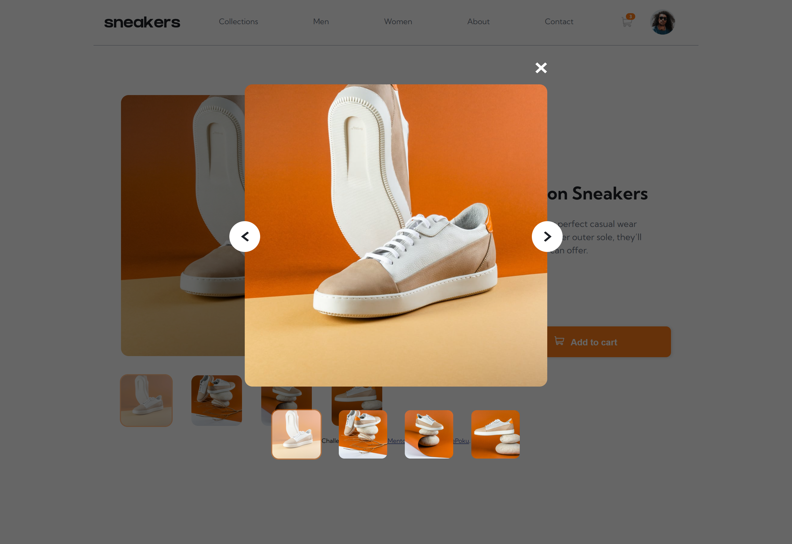
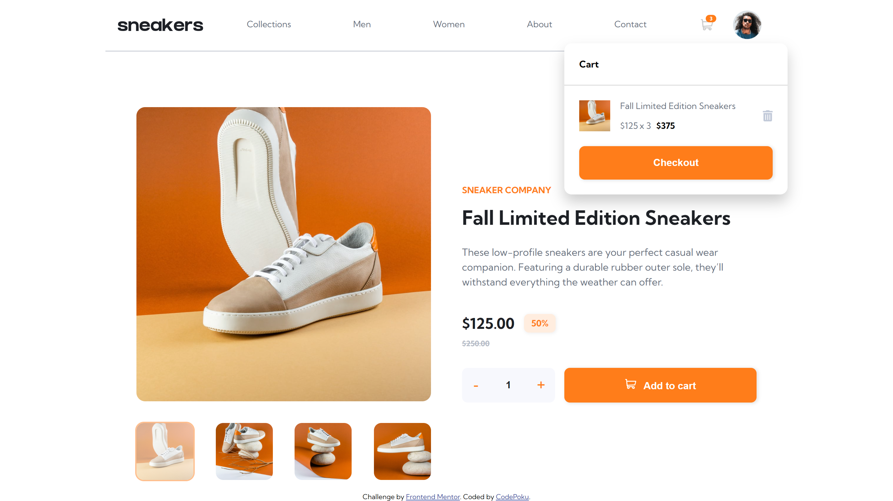

# Frontend Mentor - E-commerce product page solution

This is a solution to the [E-commerce product page challenge on Frontend Mentor](https://www.frontendmentor.io/challenges/ecommerce-product-page-UPsZ9MJp6). Frontend Mentor challenges help you improve your coding skills by building realistic projects.

## Table of contents

- [Screenshot](#screenshot)
- [Links](#links)
- [My process](#my-process)
  - [Built with](#built-with)
  - [What I learned](#what-i-learned)
  - [Continued development](#continued-development)
  - [Useful resources](#useful-resources)
- [Author](#author)
- [Acknowledgments](#acknowledgments)

### Screenshot






### Links

- Solution URL: [Site](https://github.com/CodePoku7/ecommerce-product-page)
- Live Site URL: [Site](https://codepoku7.github.io/ecommerce-product-page/)

## My process

1. I started up planning and writing up the HTML
2. Wrote the css styles
3. Added media queries and responsiveness

### Built with

- Semantic HTML5 markup
- CSS custom properties
- Flexbox
- Desktop-first workflow
- Media queries

### What I learned

This project turned out to be a challenge for me. I learned a lot of new concepts.

- Building Mobile navigation
- image slider and lightbox.
- Cart update

- I learned about filter function and how to change color with it through some external extensions.
- Also used css attributes in this project.

```css
.btn-arrow img:hover {
  filter: invert(51%) sepia(95%) saturate(1289%) hue-rotate(347deg) brightness(
      101%
    ) contrast(101%);
}

.mobile-icon[name="menu-close"] {
  display: none;
}
```

New thing for me was adding a dataset id for the images for switching.

```js
productImgThumb.forEach((img, i) => {
  img.dataset.id = i;
  img.addEventListener("click", imgChange);
});

function imgChange(e) {
  productImg.src = e.target.src;
  setMainIndex(Number(e.target.dataset.id));
  mainGallery();
}
```

### Continued development

Next step would be to improve the html and css code.
In javascript, I have some repetitive code that can be improved and removed.

## Author

- Frontend Mentor - [@CodePoku7](https://www.frontendmentor.io/profile/CodePoku7)
